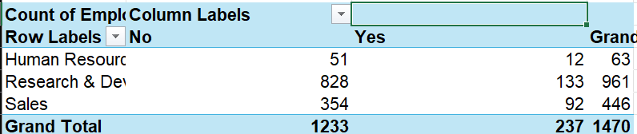
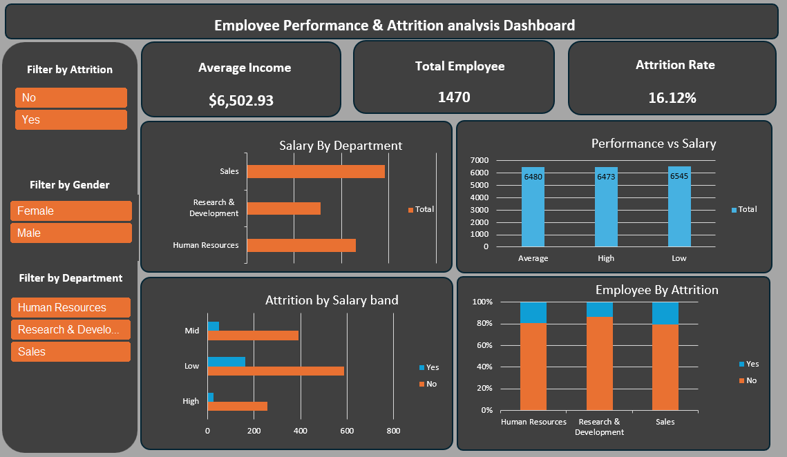
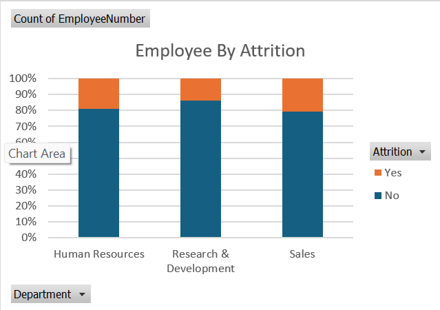
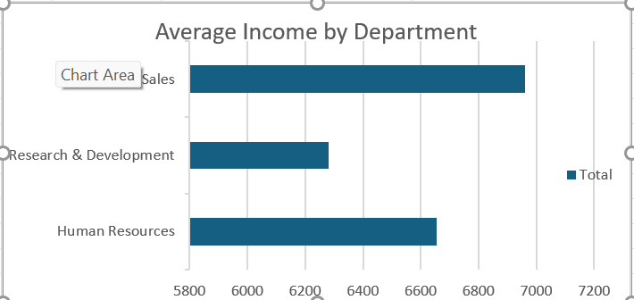
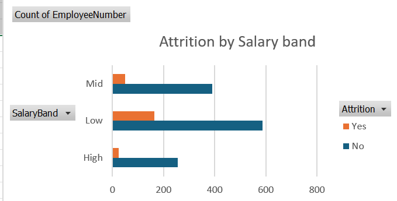
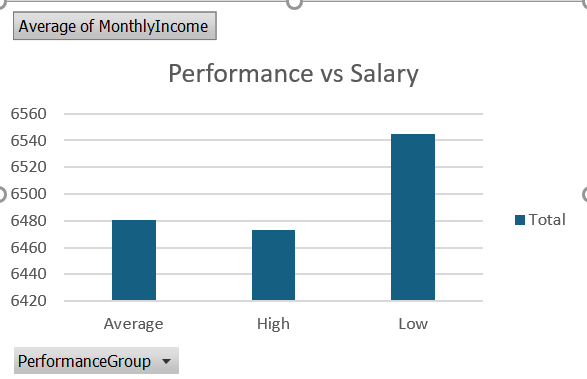

# HR Employee Attrition Analysis (Excel Dashboard)

**Author:** Patricia Fagbola | Data Analyst | 2026
**Tools:** Microsoft Excel (PivotTables, PivotCharts, Slicers)

---

## Summary

I analysed HR data for 1,470 employees to find out which groups are most likely to leave. Overall, 237 employees left, which is an attrition rate of 16.1%. Attrition was not spread evenly. Sales had the highest attrition at 20.6%, Research & Development kept people best at 13.8%, and employees in the lower salary band were more likely to leave (21.8% vs 8.9% in the high band). I put everything into an interactive Excel dashboard so an HR team can filter and explore the numbers themselves.

---

## Introduction

Employee turnover costs a company in recruitment, lost productivity, and team disruption. But it rarely happens evenly across a company, so treating it as one company-wide problem can waste effort.

The goal of this project was to find where attrition is highest and what those employees have in common, so HR can focus retention efforts where they matter most.

---

## Dataset Overview

- **Records:** 1,470 employees
- **Attributes:** 35 columns covering demographics, job details, pay, performance, and employment history
- **Source:** [add where you got the dataset]
- **Target variable:** Attrition (Yes/No)

Fields used most in this analysis: Department, Job Role, Monthly Income, Performance Rating, Years at Company, and Attrition.

---

## Analysis

I did the whole analysis in Excel using PivotTables and PivotCharts. I looked at income, attrition, and performance across departments, salary bands, performance ratings, marital status, and tenure.

- **Attrition rate** = employees who left / total employees in that group
- **Tenure groups:** New (0–2 years at company), Mid (2–5 years), Experienced (5+ years)



---

## Dashboard

I combined the PivotCharts and slicers into one interactive dashboard, so you can filter by department, job role, and other fields and see the attrition numbers change.



To explore it, open `data/HR-Employee-Attrition.xlsx` in Excel. The workbook has these sheets:

- **HR-Employee-Attrition:** raw data
- **Pivot Analysis:** supporting PivotTables
- **Dashboard:** the interactive dashboard
- **Insights:** summary of findings
- **Working Sheet:** supporting calculations

---

## Insights

**1.** The Sales department has the highest attrition rate (20.6%), while Research and Development shows the lowest (13.8%), indicating stronger employee retention within R&D. Sales also records the highest average monthly income among all departments ($6,959, compared to $6,655 in HR and $6,281 in R&D), so higher pay alone does not seem to prevent people from leaving.





**2.** Employees within the lower salary band exhibit higher attrition levels (21.8% compared to 8.9% in the high band, and 11.1% in the mid band), suggesting that compensation may be one factor influencing employee turnover.



**3.** Employees with lower performance ratings have slightly higher average incomes ($6,545 compared to $6,480 for average and $6,473 for high performers) than average and high performers. Further analysis suggests this trend is influenced by tenure: Experienced employees average $8,098 regardless of performance rating, Mid-tenure employees average $5,365, and New employees average $4,709, so tenure — not performance — appears to be the bigger driver of income.



**Side note:** Performance ratings appear consistent across marital status groups, so marital status does not seem to affect performance.

**Limitations:** This is a snapshot of one dataset. It shows which groups leave more, but not why they left, so these are patterns and not proven causes.

---

## Recommendations

1. **Look into Sales first.** Find out what is driving attrition there, such as workload, management, or career progression.
2. **Review pay for the lower salary bands,** and check that pay growth reflects both tenure and performance.
3. **Learn from R&D.** See what they do differently and whether other departments can use it.
4. **Improve onboarding and early engagement** for new employees, since they are the most likely to leave.

---

## Repository Structure

```text
HR-Attrition-Analysis/
├── README.md
├── dashboard_preview.png
├── pivot_attrition_by_department.png
├── chart_avg_income_by_department.png
├── chart_attrition_by_department.png
├── chart_attrition_by_salary_band.png
├── chart_income_by_performance.png
└── data/
    └── HR-Employee-Attrition.xlsx
```
